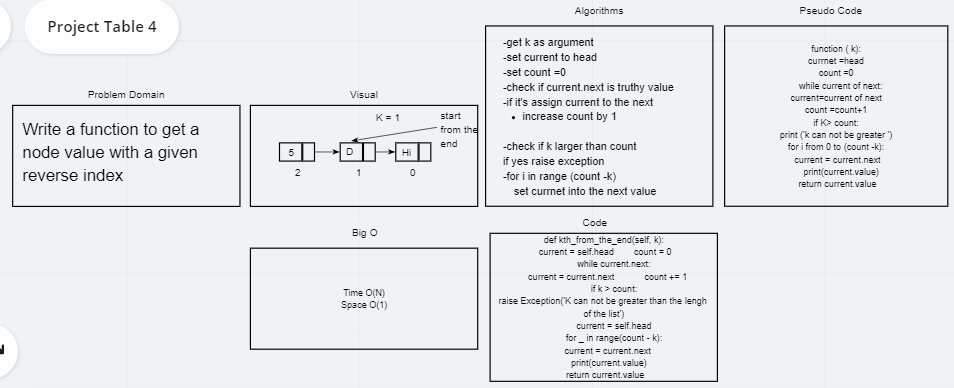

# Data Structures and Algorithms

See [setup instructions](https://codefellows.github.io/setup-guide/code-301/3-code-challenges), in the Code 301 Setup Guide.

## Repository Quick Tour and Usage

### 301 Code Challenges

Under the `data-structures-and-algorithms` repository, at the top level is a folder called `code-challenges`

Each day, you'll add one new file to this folder to do your work for the day's assigned code challenge

### 401 Data Structures, Code Challenges

# Reverse an Array
<!-- Short summary or background information -->

## Challenge
This function take any list of items, and return the reverse of it.

## Approach & Efficiency
 for the chellenge it was normal but for the test I havn't made it as the first time making test until the instructor explain how to, so it's normal now also

## Solution

# Shift an Array
<!-- Short summary or background information -->

## Challenge
This function take any list and value, and return the list with the value in the middle of it.

## Approach & Efficiency
 I check for length of the list to determine the index i will insert the value in, it takes me 1 hour 

## Solution

# Array Binary Search
<!-- Short summary or background information -->

## Challenge
Write a function called BinarySearch which takes in 2 parameters: a sorted array and the search key.return the index of the array’s element that is equal to the search key, or -1 if the element does not exist.

## Approach & Efficiency
 1 : create the function with two arguments

2 : create a result by default equal to -1 and counter =0

3 : loop through the list and counter will increment 1 each time

4 : if the key inserted was zero ill return the first item and break the loop

5 : if key is bigger than zero ill continuo loop until counter reach the value of key minus one and ill break and return the item

it take me two hours

## Solution

# Linked Lists
<!-- Short summary or background information -->

## Code challenge 5
Write a clsses and some methods to create linked list and to test them

## Approach & Efficiency
 1 : create the Node class and the constructor method for it.

2 : create the Linked list class and the constructor methos, the insert method, the inclde method, and finally the str method

3 : in constructor method I set the head to none, and in the insert method
    3:a I add a new node with the value argument
    3:b if there are a head we will set our current pointer to the head
    3:c i'll loop while there are following node to the current node 
    3:d when I finish I'll assign new node value as the next value for the head
    3:e if there are no head and one value entered we will set it as the head

4 : in the include method ill loop in the values of the linked list and check each one

5 : in the str method ill loop also iin the linked list and store each item on pre built empty string variable and return the result string

it take me three hours

## API

- The constructor method, to assign the head.value
- The insert method to insert a new node at the begining of linked lists
- the include method to check if a given value is included at the linked list
- str method to return result as readable string

## Code challenge 7

function to get a node value with a given reverse index

## Approach & Efficiency

- get k as argument
- set current to head
- set count =0
- check if current.next is truthy value
- if it's assign current to the next
- increase count by 1

- check if k larger than count
  if yes raise exception
- for i in range (count -k)
  set currnet into the next value

## WhiteBoard 

# Code Challenge: Class 08
## Code challenge 8

a function called zip Lists which
takes two linked lists as arguments.
Zip the two linked lists together
into one so that the nodes alternate
between the two lists and return a 
reference to the head of the zipped list.

## Approach & Efficiency

1. get two linked lists as parameters

2. store the heads of each linked list as cuurent1, current2

3. check the longest linked list and make it the prime one

4. assign heads

5. loop over the first one

6. link first node to the current in the second list

7. link the second current into the first next in the first linked list

8. move the first current to the next of the first current

9. move the second current to the next of the second current

10. assign the head of the second to second current

11. return the prime linked list

## WhiteBoard 

