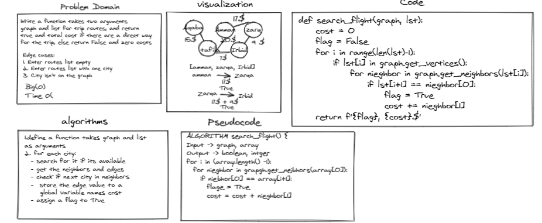

# Graph Bussiness Trip


Write a function called business trip takes two arguments: graph, array of city names, and return: cost or null.

## White Board



## Approach & Efficiency

1. define a function takes graph and list
as arguments
2. for each city:
  - search for it if its available
  - get the neighbors and edges
  - check if next city in neighbors
  -  store the edge value to a 
     global variable names cost
  - assign a flag to True


BFS traversal

- Time compexity: O(n^n)
- Space Complexity: O(n)

## Solution

```ALGORITHM search_flight() {
Input -> graph, array
Output -> boolean, intger
for i in (array.length() -1):
  for nieghbor in grapgh.get_neibhors(array[0]):
    if niebhor[0] == array[i+1]:
      flage = True
      cost = cost + nieghbor[1]
```
