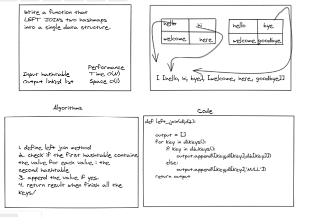

# Challenge Summary

The LEFT JOIN keyword returns all records from the left table (table1), and the matched records from the right table (table2). The result is NULL from the right side, if there is no match.

## Whiteboard Process


## Approach & Efficiency
1. define left join method
2. check if the first hashtable contains
the value for each value i the 
second hashtable
3. append the value if yes.
4. return result when finish all the
keys/


- Time complexity: O(n)
- Space complexity: O(1)

## Solution
```
def tree_intersection(tree_one,tree_two):
    result = []
    def walk(current_one, current_two):
        if current_one and current_two.root:
            if current_two.contains(current_one.data):
                result.append(current_one.data)
            if current_one.left:
                walk(current_one.left, current_two)
            if current_one.right:
                walk(current_one.right, current_two)

    walk(tree_one.root, tree_two)
    return result
    