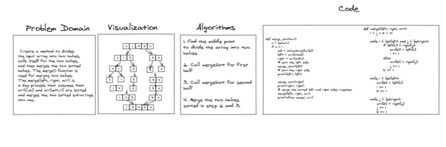

# Merge Sort

a method to divides
the input array into two halves,
calls itself for the two halves,
and then merges the two sorted
halves. The merge() function is
used for merging two halves.
The merge(left, right, arr) is
a key process that assumes that
arr[l..m] and arr[m+1..r] are sorted
and merges the two sorted sub-arrays
into one.

## Whiteboard Process



## Approach & Efficiency

1. Find the middle point
to divide the array into two
halves
 
2. Call mergeSort for first
half
   
3. Call mergeSort for second
half

4. Merge the two halves
sorted in step 2 and 3:


Time: O(n)
Space: O(n)

## Solution

```ALGORITHM Mergesort(arr)
    DECLARE n <-- arr.length
           
    if n > 1
      DECLARE mid <-- n/2
      DECLARE left <-- arr[0...mid]
      DECLARE right <-- arr[mid...n]
      // sort the left side
      Mergesort(left)
      // sort the right side
      Mergesort(right)
      // merge the sorted left and right sides together
      Merge(left, right, arr)

ALGORITHM Merge(left, right, arr)
    DECLARE i <-- 0
    DECLARE j <-- 0
    DECLARE k <-- 0

    while i < left.length && j < right.length
        if left[i] <= right[j]
            arr[k] <-- left[i]
            i <-- i + 1
        else
            arr[k] <-- right[j]
            j <-- j + 1
            
        k <-- k + 1

    if i = left.length
       set remaining entries in arr to remaining values in right
    else
       set remaining entries in arr to remaining values in left
```

