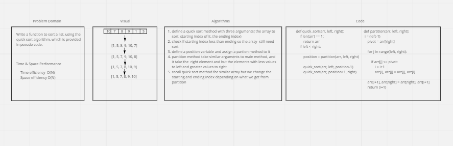

# Quick Sort

The key process in quickSort is partition(). Target of partitions is, given an array and an element x of array as pivot, put x at its correct position in sorted array and put all smaller elements (smaller than x) before x, and put all greater elements (greater than x) after x. All this should be done in linear time.

## Whiteboard Process



## Approach & Efficiency

1. Find the middle point
to divide the array into two
halves
 
2. Call quick_sort for first
half
   
3. Call quick_sort for second
half


Time: O(n)
Space: O(n)

## Solution

```

def quick_sort(arr, left, right):
    if len(arr) == 1:
        return arr
    if left < right:

        position = partition(arr, left, right)

        quick_sort(arr, left, position-1)
        quick_sort(arr, position+1, right)

def partition(arr, left, right):
    i = (left-1)
    pivot = arr[right]
  
    for j in range(left, right):
  
        if arr[j] <= pivot:
            i = i+1
            arr[i], arr[j] = arr[j], arr[i]
  
    arr[i+1], arr[right] = arr[right], arr[i+1]
    return (i+1)
  


```

