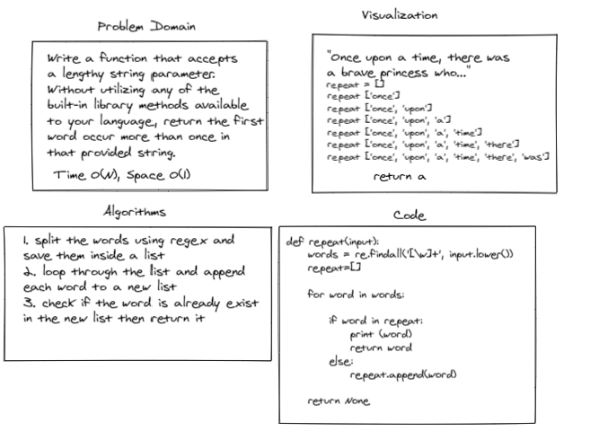

# Challenge Summary

We want to return the first word repeated in a paragraph.

## Whiteboard Process



## Approach & Efficiency

We have existing solution for this problem please refer Find the first repeated word in a string link. We can solve this problem quickly in python using empty list.

First split given string in alist using regex.
Now loop through list of words and append them into a new list.

umtil we reach a word that already appendend in the created list we return it.

- Time complexity: O(n)
- Space complexity: O(1)

## Solution
```
def repeat(input): 
    words = re.findall('[\w]+', input.lower())
    repeat=[]

    for word in words:
        
        if word in repeat: 
            print (word) 
            return word
        else:
            repeat.append(word)

    return None
    