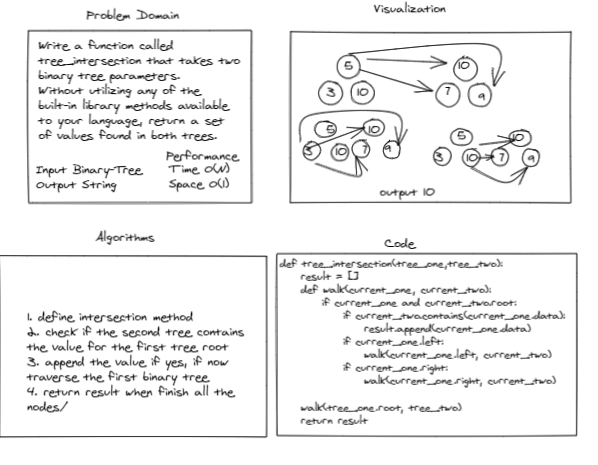

# Challenge Summary

Binary Trees can be in many shapes but are most useful when balanced. Walking Binary Trees in depth-first order is done the same as walking Binary Search Trees which can be done in pre-order, in-order or post-order. Binary Trees, like Binary Search Trees, can also be walked in depth-first order

## Whiteboard Process



## Approach & Efficiency

The challenge is broken into two functions: tree_intersection and contains method whch is a method in my binary tree class. The tree_intersection is the main function which uses the contains method as a helper for walking a Binary Tree recursively. At each recursive step of the walk a value is either added to a list  or added to an intersection set of the two trees. Time complexity of tree_intersection is O(N). Space complexity of walk is O(1) .

- Time complexity: O(n)
- Space complexity: O(1)

## Solution
```
def tree_intersection(tree_one,tree_two):
    result = []
    def walk(current_one, current_two):
        if current_one and current_two.root:
            if current_two.contains(current_one.data):
                result.append(current_one.data)
            if current_one.left:
                walk(current_one.left, current_two)
            if current_one.right:
                walk(current_one.right, current_two)

    walk(tree_one.root, tree_two)
    return result
    